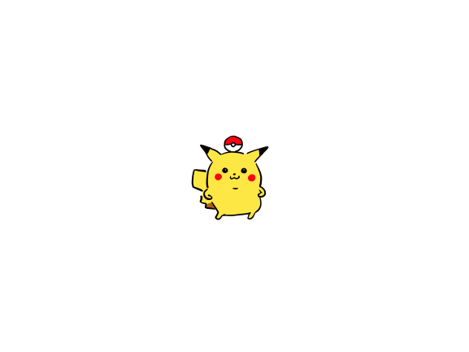

# Pikachu
Pikachu is the mascot of this project because why not, 可愛いじゃん


*就决定是你了，皮卡丘！*
```
We would've designed our own logo if this were commercial.
```
# User Interface
I'll walk you through user interface structure, every page, every button.
# Physical Setup
How to place the wafer (to be measured), 6-contact probe
# Accuracy and Limitations
* The number of contact pins is fixed, six.
  And this limits the number of measured data points and thus limits the accuracy of the result.
  This limitation might be quantized...
